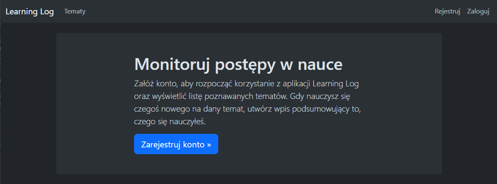
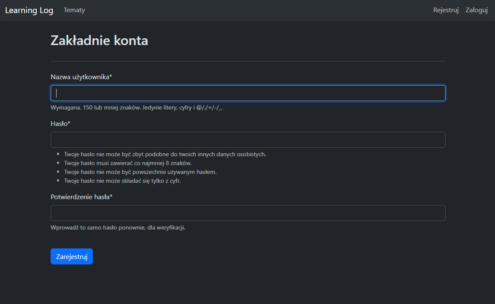
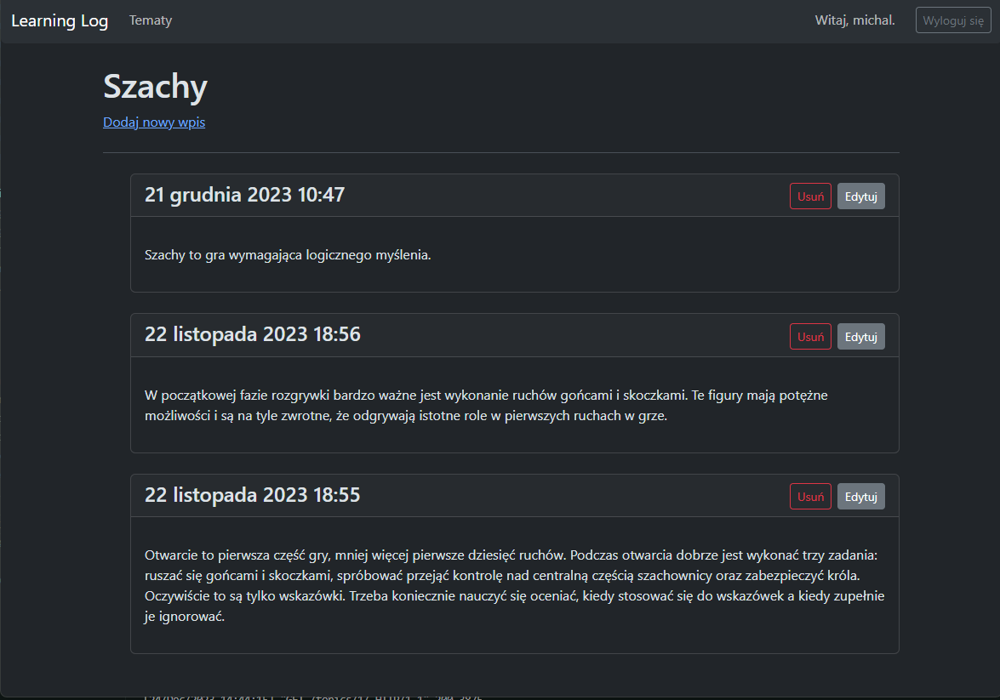

# Learning Log
The Learning Log app is a platform designed to help users track and organize their learning progress across various topics. Built using Django and styled with Bootstrap 5, it offers a structured and user-friendly interface for managing information related to the user's learning journey.

## Demo
Some photos describing a little this project.

### Landing page

### Register page

### Topic page


## Environment Variables
If you want to run this application, you should have an .env file with the following data.
```env
SECRET_KEY=...
DATABASE_URL=...
DEBUG=False
```